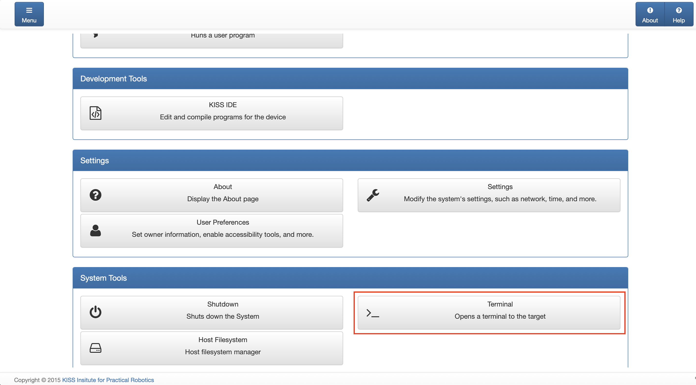
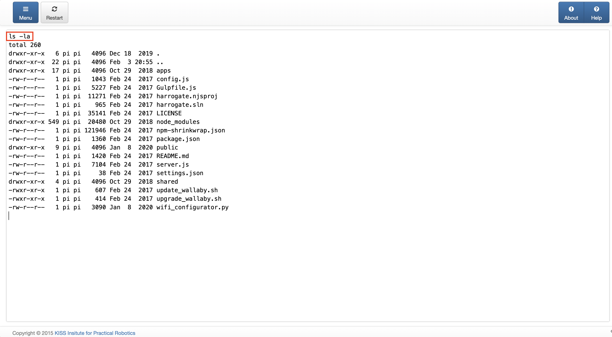

# Wombat SSH user setup

This section will guide you through the process of setting up a non-root user on the default Wombat Image (version 25.8). 

## Requirements

 - computer or phone with a web browser and a network connection to the Wombat.

## Getting a Console

In order to create the linux user, you need to access the integrated console on the KISS web-interface. 

To do so, navigate to the IP Address of your Wombat and port 8888 in the browser. When connected using the integrated WiFi, the IP will be ```192.168.125.1```. When connected using the Ethernet cable you need to check what IP address it was assigned via DHCP.

For this Example, we will use the following address:

http://192.168.125:8888

From the main menu, navigate to the Terminal:



In there you will get a rudimentary root terminal. It doesn't even show a prompt and is very quirky but good enough to create a user. You can use ```ls -la``` to check that it is working:



Once you made sure the terminal is working, use the following commands to create a new user called ***access***:

```bash
useradd -m access       # Create the user "access"
passwd access           # Set the password for "access", e.g. "access"
usermod -aG sudo access # Add "access" to the sudo group so you can use sudo
```

If all was done correctly, you can now log in to the Wombat using SSH and the user "access":

```bash
ssh access@192.168.125.1
```